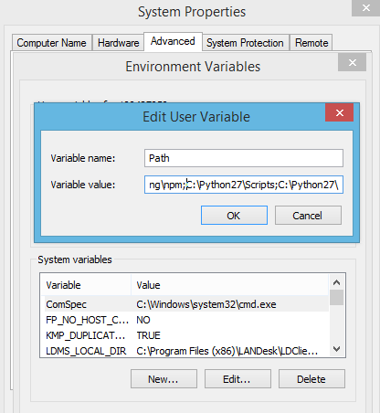
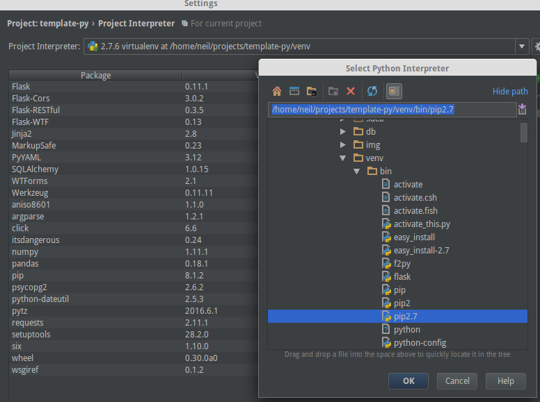
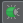

# Assignment1-SOFE4620
Repository to hold SOFE 4620 project template that uses python and windows in a virtual environment. 

# Setup
- [Windows](#windows-setup)
- [Pycharm Setup](#pycharm-ide-setup)
- [Running Project](#run-project)

# Windows Setup
- Install git [if not already installed](https://git-scm.com/download/win)
- Clone project *run in cmd as admin*
```
git clone https://github.com/GitEntity/Assignment1-SOFE4620
```
- Install [Python}(https://www.python.org/downloads/)
- Add Python and Python scripts to path variable, **no spaces**



- Install dependencies *run in cmd as admin in project folder*
- More documentation on [venv](http://docs.python-guide.org/en/latest/dev/virtualenvs/)
```
pip install virtualenv virtualenvwrapper
virtualenv venv
venv\Scripts\activate
pip install -r requirements.txt
deactivate
```


# PyCharm IDE Setup
- download and install [PyCharm](https://www.jetbrains.com/pycharm/)
- you can get a free license from JetBrains if you are a [student](https://www.jetbrains.com/student/)
- to add your venv as an interpreter follow these [instructions](https://www.jetbrains.com/help/pycharm/2016.1/adding-existing-virtual-environment.html)



# Code Required (available in repository)

_setup.py_
```
try:
    from setuptools import setup, find_packages
except ImportError:
    from distutils.core import setup

config = {
    'description': 'This package is used for scraping sports analytics data from the foot-data API to provide
                   'football data of all major european in a machine-readable way.',
    'author': 'Devante Wilson',
    'author_email': 'devante.wilson@outlook.com',
    'version': '0.0.1',
    'packages': find_packages(),
    'name': 'soccer_package'
}

setup(**config)
```
_connect.py_
```
# Author: Devante Wilson
# Date: 7/28/2018
# Description: Connect to the API site in order to scrape data intended for writing to .csv file.
import http.client
import json
import pandas as pd

# setup the connection to the api site
connection = http.client.HTTPConnection('api.football-data.org')
headers = { 'X-Auth-Token': '49545ccc5fa148e889e3cc4a7f7d6113', 'X-Response-Control': 'minified' }
connection.request('GET', '/v1/competitions/446/leagueTable', None, headers )
# read and decode the json data in the response
response = json.loads(connection.getresponse().read().decode())

# output the list to the console
print(response)

# write DataFrame to a comma seperated values (csv) file
data = pd.DataFrame(response)
data.to_csv('PremierLeague.csv', index=False)
```

- use configurations created in PyCharm for `connect.py'
- to run, click the green arrow button besides the dropdown used for configuration


For other soccer data resources: http://api.football-data.org/documentation

- to debug, click on the green sun icon


